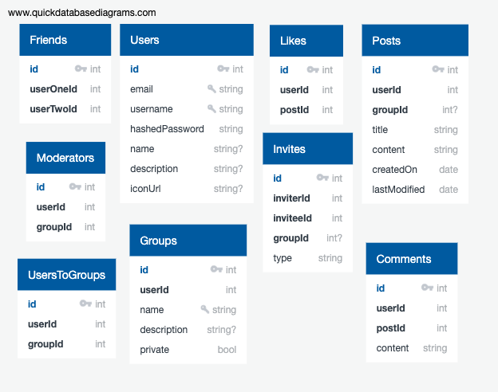

[Features](/documentation/Features.md)
[Components](/documentation/Components.md)
[Database Schema (image)](/documentation/DBschema.png)
[Database Schema (text)](/documentation/DBschema.md)
[Frontent Routes](/documentation/frontendRoutes.md)
[API Routes](/documentation/apiRoutes.md)
[Redux Store Tree](/documentation/store.md)


<br />
<p align="center">
<a href="https://blabberapp.herokuapp.com/">
    </a>
<a href="https://blabberapp.herokuapp.com/">
  <h3 align="center">Blabber</h3></a>
  


</p>


<!-- TABLE OF CONTENTS -->
<details open="open">
  <summary><h2 style="display: inline-block">Table of Contents</h2></summary>
  <ol>
    <li>
      <a href="#about-the-project">About The Project</a>
      <ul>
        <li><a href="#technical-stack">Technical Stack</a></li>
        <li><a href="#introduction">Introduction</a></li>
        <li><a href="#mvp">MVP</a></li>
      </ul>
    </li>
    <li>
      <a href="#getting-started">Getting Started</a>
      <ul>
        <li><a href="#prerequisites">Prerequisites</a></li>
        <li><a href="#installation">Installation</a></li>
      </ul>
    </li>
    <li><a href="#usage">Usage</a></li>
    <li><a href="#api-frontend">API Frontend</a></li>
    <li><a href="#api-backend">API Backend</a></li>
  </ol>
</details>


<!-- ABOUT THE PROJECT -->
## About The Project
* .


* .


* .


* Initial load page that displays posts.


* User profile page.


* Search page.


* Business owner user can create business.


* Database Schema



### Technical Stack

* Frontend built with JavaScript, React, Redux.
* Backend built with Python and Flask SQLAlchemy.


### Introduction

A socail media site where users can join groups and make friends.


### Features

1. Groups
    * List of posts within group
    * Group page header:
        * group name (unique)
        * number of users (list on click)
        * description
        * join option (if public)
        * chat room link
    * Create, edit, and delete your own group
        * can set group to public or private
        * delete group
        * delete posts and remove users from group
    * User can join other groups
        * can join through invites
2. Posts
    * Make posts in group page
        * edit and delete your own post
        * comment on other user's posts
3. Friends
    * Friend and unfriend other users
4. Search
    * Search feature to find groups, posts, and users (filter option on search page)
5. User Profile
    * Shows list of posts by that user
    * User profile header:
        * user info
        * button to friend or unfriend
6. Likes
    * like posts
<!-- 7. Moderators
    * Group owner can set members to be moderators
        * moderator can edit group information, remove regular members, and delete posts
        * moderators can remove themselves from being moderators -->

    


<!-- GETTING STARTED -->
<!-- ## Getting Started -->
<!-- ----------- -->

<!-- To get a local copy up and running follow these simple steps. -->

1. 

<!-- ### Prerequisites


### Installation -->
<!-- 

1. Clone the repo
   ```sh
   git clone https://github.com/ransonk/group-yelp-project.git
   ```
2. Install NPM packages
   ```sh
   npm install
   ```
3. Create your postgres database and connect it to the app.

4. On the root directory to run frontend and backend
   ```sh
   npm start
   ```
5. browse to http://locahost:8080. -->


<!-- USAGE EXAMPLES -->
<!-- ## Usage
----------- -->


## Frontend Routes
--------------------------


|           path            |                       description                     |
|---------------------------|-------------------------------------------------------|
|   /                       | main page, show posts from user's friends and groups  |
|   /groups/id              | group page, show posts made in the group              |
|   /groups/new             | make new group form                                   |
|   /search                 | search page, find search results for gorups and users |
|   /users/id               | profile page, show user's posts                       |
|   /users/id/friends       | friends page, list the user's friends                 |
|   /users/id/likes         | likes page, show user's likes                         |
|   /notifications          | shows all received invites and pending sent invites   |
|   /users/id/groups        | groups page, shows list of groups user is in          |
|   /signup                 | signup page                                           |
|   /login                  | login page                                            |


--------------------------

## API Backend
-----------

|        PATH                    |     ACTION        |
|--------------------------------|-------------------|
| /api/users/id/posts            |      GET          |
| /api/users/id/friends          |      GET          |
| /api/users/id/groups           |      GET          |
| /api/users/id/invites          |      GET          |
| /api/users/id/profile          |      PUT          |
| /api/groups                    |      POST         |
| /api/groups/id/users           |      GET          |
| /api/groups/id/users/id        |      DELETE       |
| /api/groups/id/users           |      POST         |
| /api/groups/id                 |      GET          |
| /api/groups/id                 |      PUT          |
| /api/groups/id                 |      DELETE       |
| /api/groups/id/moderators      |      POST         |
| /api/groups/id/moderators/id   |      DELETE       |
| /api/invites/users/id/friend   |      POST         |
| /api/invites/users/id/group/id |      POST         |
| /api/invites/users/id/group/id |      DELETE       |
| /api/invites/users/id/friend   |      DELETE       |
| /api/posts/users/id            |      GET          |
| /api/posts                     |      POST         |
| /api/posts/id                  |      GET          |
| /api/posts/id                  |      PUT          |
| /api/posts/id                  |      DELETE       |
| /api/posts/id/comments         |      POST         |
| /api/posts/comments/id         |      PUT          |
| /api/posts/comments/id         |      DELETE       |